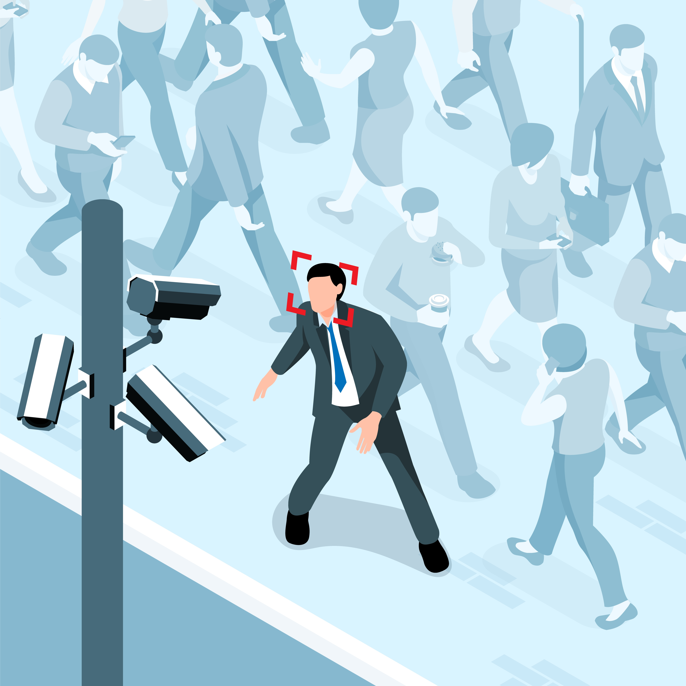

# How Can the Government Use our Personal Data to Spy on Us ?

  
 

**keywords:** digital identity, personal data, mass surveillance, government surveillance, manipulation, existential risks

## Introduction
Nowadays, our increasing online engagement leads most individuals to expose some of their personal information to the world. Whether sharing with friends on social networks, accidentally agreeing to give information through website cookies, or providing information to the government through documents like driver's licences, people often engage in this information exchange without full awareness of the consequences that may follow. In this essay, we will explore how can some governments use the personal data of their citizens. Although we are aware that the government exploits our data for a variety of purposes, it is interesting to explore the depth of how our personal data can actually be used by the government, well beyond what we might initially imagine. This research raises crucial questions about the limits of privacy in an increasingly connected world.  

We will begin our discussion by addressing a significant issue in the West. Then, we will delve into those present in China. Lastly, we will turn our attention to the situation in Israel, where similar problems persist. Our objective is to gain a nuanced understanding of the diverse issues with our personal data across different countries that can somehow affect us.

## The Ambiguity Linked to How our Data Is Used

Personal data includes details such as a person's name, age, or e-mail address and can be used to identify an individual.[^1] Each country generally has its own legislation regulating data collection. Most governments claim to use our personal data for research purposes, “leading to new knowledge about health, diseases, and effective services to promote and support the development of individuals and communities." (Teng, 2019)[^2] Particularly in the context of the pandemic, where the use of personal data enabled many countries to map the spread of the virus.

However, this practice can quickly become confusing. It is worth mentioning the Facebook-Cambridge Analytica scandal in 2018, where data collected without user consent was used to profile and target voters for the benefit of former US President Donald Trump during his victorious 2016 presidential campaign. The documentary film “The Great Hack”[^3], available on Netflix, thoroughly analyses this scandal, shedding light on the potential dangers to democracy and human rights posed by unregulated data collection.

It should be noted that this problem is not limited to a single company but also to governments, which use companies to obtain personal data. A good example is the US government, which collects personal data from its citizens. According to an article published in Sciences et Avenir[^4], a French popular science magazine, many government agencies sign contracts with private companies to collect personal data. The article mentions collaborations such as those between the Defence Intelligence Agency and LexisNexis, as well as agreements between the Navy and a company called Sayari Analytics. The US government's purchases reveal sensitive data on millions of people, such as private life, social class, and political opinions. This demonstrates that governments can use our personal data for purposes other than those often proclaimed to be "for our own good".  

This serves as a modest illustration of potential issues faced by Western countries, but our focus will shift to China, a more significant example of how both companies and the government can leverage personal data, potentially compromising the rights of certain citizens.

## China & the Social Credit System
### What it Consists
Officially announced in 2014, China's Social Credit System is a government-run system to monitor and evaluate the conduct of individuals and companies aimed at "creating a more harmonious and stable society by encouraging positive behaviour and discouraging negative behaviour" (ZhaoZhao, 2023).[^5]    

This system consists of evaluating individuals by awarding points based on their behaviour. The credit points accumulated offer advantages, such as easier access to credit or employment. On the other hand, those with a low credit score may face sanctions, such as being refused access to certain services such as travel, education, or healthcare. The Chinese government's press agency, Global Times, recently stated that 11 million people had been prevented from flying and 4.5 million from taking the train.  

Data collection is the foundation of this system. Information is gathered from a variety of sources, including government agencies and social media platforms. These data are then used to assign a credit rating. To facilitate the rating process, "the Chinese government plans to install more than 600 million surveillance cameras" (Briner, 2021)[^6].  
 

  
 

Since 2014, China has only been experimenting with this project, but the experiment was considered conclusive: since 2020, it has been applied throughout the country, "subjecting 1.4 billion people to the world's first digital dictatorship" (Rey, 2022)[^7].  

### An Abuse of Power
Also called "digital totalitarianism”, this system has considerable consequences. The Chinese government's data collection and constant surveillance create an oppressive atmosphere, strongly reminiscent of a dystopia that closely resembles George Orwell's 1984. Individuals with poor credit can be deprived of certain fundamental rights, such as access to healthcare, constituting an abuse of government power. Therefore, this system discriminates against people with poor credit. 

Concerns have been raised about the possibility of the government using this system to target and discriminate against individuals or groups based on their political beliefs or other personal characteristics. In the French documentary “Tous surveillés : 7 milliards de suspects”, this system is purportedly implemented with the intention of "promoting communist morality, even in the most remote areas."[^8]. In the documentary, they interviewed Bextiyar Tursun, a Chinese resident. He said that many technologies have been created over the years, including police cars, which were equipped with machines that could capture conversations from a distance. That's why, every time a police car drove by, he stopped his conversation with his friend. Similarly, to talk about politics, Bextiyar would drive up to 50 kilometres outside the city in the mountains with friends.  

This proves that the government exploits this mass surveillance to identify and repress individuals who are not sufficiently loyal to the Communist Party, particularly with the omnipresence of hundreds of millions of surveillance cameras. This reality creates a climate of fear and propaganda. The ability to identify individuals easily, whether on social networks or in everyday life, makes it easier to convert certain people. This also implies that if someone is not communist enough, they could possibly be denied access to healthcare, which is deeply worrying. Given a situation where a person is between life and death and requires medical care, should they be condemned to death simply because of their poor credit? Is it possible that the government is seeking to eliminate those with poor credit in favour of a society made up exclusively of "honest citizens"?  

According to the New York Times, "the number of countries with political disinformation campaigns on social medias doubled in the past two years"[^9]. This highlights the scale of the problem and the need to think critically about the implications of data collection and government surveillance on society.  

## Where Can This Lead Us?
### China
Discrimination against a specific group is already apparent in China, not only people who are not sufficiently loyal to the Communist Party, but also people of other religions, such as the Uyghurs, who are predominantly Muslim. Human rights groups estimate that China has imprisoned more than a million Uyghurs against their will in recent years in what the state calls "re-education camps", and sentenced hundreds of thousands to prison sentences[^10]. According to the French documentary, members of this community can be sent to concentration camps simply for buying a Koran. China has been accused of committing crimes against humanity, and even genocide, according to many governments, including the Canadian Parliament, which has recognised the Uyghur genocide. (Reyhan, 2021)[^11]. Aaron Peskin, Chairman of the Supervisory Board, even compares it to the Nazi regime. This mass surveillance can amplify this discrimination by identifying Uyghurs and sending them to camps.

### Israel
Mass surveillance is not limited to China; other countries can also be confronted. Israel serves as an example with its "Blue Wolf" technology launched in 2016. According to an article from the France Palestine Solidarity Association[^12], this technology captures images of Palestinians and then matches them with a database held by the Israeli army and intelligence services. Using facial recognition, the Israeli government can identify any individual of Palestinian origin. We are aware of the ongoing genocide in Palestine. Facial recognition could therefore potentially be used as a tool by the government to eliminate all Palestinians identified by surveillance cameras, thereby contributing to the eradication of this community.  

### Existencial risk
In his thesis titled "Existential Risks: Analyzing Human Extinction Scenarios and Related Hazards"[^13] Dr. Nick Bostrom explores various perspectives on risks that could lead to human extinction. One that particularly captures our attention is the "Repressive Totalitarian Global Regime." Dr. Bostrom discusses the possibility of an “intolerant world government”, based on mistaken religious or ethical convictions. This notion can be linked with the concrete example of China's social credit system. Dr. Bostrom suggests that the formation of such a global government could arise from a small group of individuals controlling the first superintelligence and determining its objectives. If superintelligence were to suddenly emerge and become powerful enough to take control of the world, the posthuman world might only reflect the idiosyncratic values of the owners or designers of that superintelligence. Depending on the nature of these values, such a scenario could be considered an existential threat, thus posing a significant risk to our existence.  

  
 

This mass surveillance, originally intended to promote the "good," could degenerate due to government convictions. Let's imagine that China uses its mass surveillance for the benefit of the Communist Party and spreads this influence worldwide. With its propaganda and the amassed personal data, one can envision an Orwellian future where a global government seizes control over everyone and eradicates its adversaries. Even though this hypothesis is quite dystopian and negative, many signs lead us to believe that it could genuinely happen.
  
## Conclusion
The widespread use of personal data by governments for surveillance purposes raises major concerns about privacy, individual rights, and the potential risks of abuse of power.  

The Facebook Cambridge Analytica scandal serves as a reminder that concerns about personal data are not exclusive to Chinese citizens but extend to individuals in democratic countries like the United States. As demonstrated by this scandal, the use of our personal data can influence and shape our thoughts and beliefs. However, the exploitation of our personal data, coupled with the implementation of mass surveillance, can create an environment of fear that not only influences but also constrains people's convictions and beliefs. It is the case with China's social credit system, which forces citizens to align with the government's communist ideas. Unfortunately, similar apprehensions arise in Israel, where the deployment of the "Blue Wolf" technology raises serious concerns. While typically employed to identify Palestinians, the government utilises it to eliminate them.  

These instances highlight the broader implications of technological surveillance on privacy, security, and the manipulation of political landscapes. Many countries may be affected, whether in America, the Middle East, or East Asia. We might therefore wonder whether Europe might not be the next continent to be affected, especially if we take into account Russia, which is a country far from democracy. Even though our personal data can be put to good use, some people holding power, particularly governments, can exploit it for their own ends.

### Recommendations
Regulations must be introduced to regulate the way governments collect, store, and use personal data. Without appropriate measures, mass surveillance can easily lead to scenarios where privacy becomes a relic of the past and political manipulation flourishes.  

As individuals, there are a number of things we can do to reduce its potential abuse: 
-	Be aware of the privacy policies of the online platforms we use;
-	Favour security options, such as two-factor authentication;
-	Encourage the introduction of stricter regulations on the collection and use of data by governments;
-	Use social medias with greater caution.

For Chinese citizens, the recommendations are more complex because of China's social system, but here are some suggestions:
- Be wary of public Wi-Fi;
- Be mindful of social media activity and don't share too much information;
- Regularly update privacy settings;
- Stay informed about laws to understand your rights regarding your personal data.

## Image credits
- Image by <a href="https://www.freepik.com/free-photo/security-guard-workspace_40473667.htm#page=2&query=government%20surveillance&position=5&from_view=search&track=ais&uuid=d5b93661-2dec-4925-801e-44688d10daec">Freepik</a>
- <a href="https://www.freepik.com/free-vector/isometric-public-security-composition-street-scenery-with-walking-people-person-having-his-face-recognized_17102695.htm#query=mass%20surveillance&position=2&from_view=search&track=ais&uuid=a9a6c5f7-5415-44ce-ada4-9b68ed11ea61">Image by macrovector</a> on Freepik
- Image by <a href="https://www.freepik.com/free-photo/front-view-man-holding-world-globe_43568700.htm#query=world%20government&position=3&from_view=search&track=ais&uuid=75b284b8-a17c-4d80-a6e5-69d2f4e34cdd">Freepik</a>

## References
[^1]:	Redden, A. (2023, October 10). Companies are collecting your personal data. Here’s what you need to know. Euronews. https://www.euronews.com/next/2023/08/14/companies-are-collecting-your-personal-data-heres-what-to-know   
[^2]:	Teng, J. (2019, July 31). Data collected by governments can be useful to researchers, but only when accessed carefully. The Conversation. https://theconversation.com/data-collected-by-governments-can-be-useful-to-researchers-but-only-when-accessed-carefully-11657   
[^3]:	The Great Hack. (2019, July 24). [Video]. Netflix. https://www.netflix.com/title/80117542   
[^4]:	Da Ponte, M. (2023, June 16). Le gouvernement américain collecte des données personnelles de ses citoyens. Sciences Et Avenir. https://www.sciencesetavenir.fr/high-tech/data/le-gouvernement-americain-collecte-des-donnees-personnelles-de-ses-citoyens_171977   
[^5]:	ZhaoZhao, M. (2023, August 23). Powerful China Social Credit System: A Guide in 2023. HROne. https://www.hrone.com/blog/china-social-credit-system/   
[^6]:	Briner, C. (2021, November 18). La Chine veut noter tous ses habitants et installe 600 millions de caméras. rts.ch. https://www.rts.ch/info/monde/11137943-la-chine-veut-noter-tous-ses-habitants-et-installe-600-millions-de-cameras.html  
[^7]:	Louvet, S. (2020). Tous surveillés : 7 milliards de suspects [Video]. ARTE. https://educ.arte.tv/program/tous-surveilles-7-milliards-de-suspects 
[^8]:	Rey, L. (2022, May 13). Venu de Chine, le crédit social se répand en Europe. Bon Pour La Tête. https://bonpourlatete.com/actuel/venu-de-chine-le-credit-social-se-repend-en-europe  
[^9]:	Alba, D., & Satariano, A. (2019, September 26). At least 70 countries have had disinformation campaigns, study finds. The New York Times. https://www.nytimes.com/2019/09/26/technology/government-disinformation-cyber-troops.html  
[^10]:	Ouïghours en Chine : qui sont-ils et pourquoi Pékin est-il accusé de génocide ? (2022, May 30). BBC News Afrique. https://www.bbc.com/afrique/monde-61583982 
[^11]: Rehyan D. (2021). « Génocide ouïghour : cheminement d’un projet colonial », Monde chinois, 2021/1 (N° 65), p. 9-22. https://www.cairn.info/revue-monde-chinois-2021-1-page-9.htm  
[^12]:	Blue Wolf, l’application utilisée par Israël pour espionner les Palestiniens en Cisjordanie occupée. (n.d.). Association France Palestine Solidarité. https://www.france-palestine.org/Blue-Wolf-l-application-utilisee-par-Israel-pour-espionner-les-Palestiniens-en
[^13]:	Bostrom, N. (2002). Existential risks: analyzing human extinction scenarios and related hazards. https://ora.ox.ac.uk/objects/uuid:827452c3-fcba-41b8-86b0-407293e6617c/download_file?file_format=application%2Fpdf&safe_filename=Existential%2Brisks%3A%2Banalyzing%2Bhuman%2Bextinction%2Bscenarios%2Band%2Brelated%2Bhazards&type_of_work=Journal+article 
